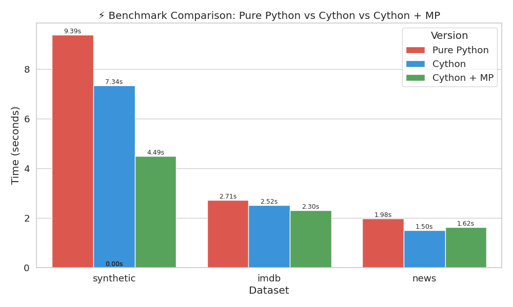

# ⚡ Cython Speedup Pipeline

An optimized NLP text processing pipeline using **Cython** and **multiprocessing**, demonstrating performance improvements over pure Python on real-world datasets like **IMDb reviews** and **news headlines**.

This project shows how adding static typing and releasing Python’s Global Interpreter Lock (GIL) in performance-critical code can lead to significant speedups — especially when processing large amounts of text.



---

## 📌 What We’re Doing

Natural language processing often involves tokenizing and normalizing large amounts of text (like news articles or movie reviews). In this project, we:

- Tokenize text data using `split()` logic
- Normalize word frequencies
- Compare runtime performance using:
  - **Pure Python**
  - **Cython-compiled functions**
  - **Cython + multiprocessing**

This lets us study how performance scales across different optimization techniques and datasets.

---

## 🚀 Why Time Reduces with Cython

- Cython allows adding **C-style static types** (`cdef int`, `double`, etc.)
- This removes dynamic Python overhead in tight loops
- Releasing the GIL with `nogil` in independent computations allows safe threading or multiprocessing
- As a result, Cython runs **faster** than interpreted Python — especially in CPU-heavy tasks like loops over big text corpora

---

## ❓ Why Multiprocessing *Doesn’t Help* for News Dataset

In the **news headlines dataset**, each text input is **very short** (5–10 words).  
Multiprocessing adds overhead for:

- Spawning processes
- Serializing data between processes
- Reconstructing the result

Since each unit of work (a headline) is **very small**, the overhead dominates — making multiprocessing slightly slower than single-threaded Cython.

> ✅ Multiprocessing shines only when **work per input is large** (like full Wikipedia articles or long reviews).

---

## 📊 Benchmarks

| Dataset   | Version             | Time (sec) | Speedup |
|-----------|---------------------|------------|---------|
| Synthetic | Pure Python         | 9.39       | 1.0x    |
| Synthetic | Cython              | 7.34       | 1.28x   |
| Synthetic | Cython + MP         | 4.49       | 2.09x   |
| IMDb      | Pure Python         | 2.71       | 1.0x    |
| IMDb      | Cython              | 2.52       | 1.08x   |
| IMDb      | Cython + MP         | 2.30       | 1.18x   |
| News      | Pure Python         | 1.98       | 1.0x    |
| News      | Cython              | 1.50       | 1.32x   |
| News      | Cython + MP         | 1.62       | 1.22x   |

📌 **Note**: Longer text = more benefit from optimization.

---

## 🛠 Project Structure

cython-speedup-pipeline/
├── pure_python/                # Pure Python baseline implementation
│   ├── pipeline.py             # Tokenization and processing logic (Python)
│   ├── benchmark.py # Benchmarking on synthetic dataset
│   ├── benchmark_imdb.py      # Benchmarking on IMDb reviews
│   └── benchmark_news.py      # Benchmarking on news headlines
│
├── cython_version/            # Cython-optimized versions
│   ├── pipeline.pyx           # Cython implementation of text processor
│   ├── setup.py               # Cython build script
│   ├── benchmark.py
│   ├── benchmark_imdb.py
│   └── benchmark_news.py
│
├── data/                      # Text datasets (ignored in Git)
│   ├── imdb_reviews.csv
│   ├── news_headlines.csv
│   └── synthetic_large_text.csv
│
├── results/                   # Benchmark output and visualizations
│   ├── benchmark_results.csv  # Raw timing data
│   ├── benchmark_results.md   # Table format of benchmark
│   └── benchmark_plot.png     # Visual comparison bar chart
│
├── notebook/
│   └── benchmark_plot.ipynb   # Jupyter notebook to visualize benchmark data
│
├── generate.py      # Script to generate synthetic large text
├── generate_imdb.py           # Script to download IMDb dataset
├── generate_news.py           # Script to download news headlines dataset
└── README.md                  # Documentation for project

## Generate Datasets
This will create the CSV files in the data/ folder:
```
python generate_synthetic.py
python generate_imdb.py
python generate_news.py
```
## How to Run Benchmarks
Run the benchmark scripts for each version below:

## Pure Python
```
python pure_python/benchmark.py
python pure_python/benchmark_imdb.py
python pure_python/benchmark_news.py
```
## Cython
```
python cython_version/benchmark.py
python cython_version/benchmark_imdb.py
python cython_version/benchmark_news.py
```
## Cython + Multiprocessing
```
python cython_version/benchmark_parallel.py
python cython_version/benchmark_imdb_parallel.py
python cython_version/benchmark_news_parallel.py
```
